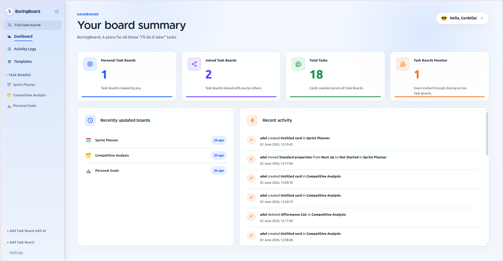
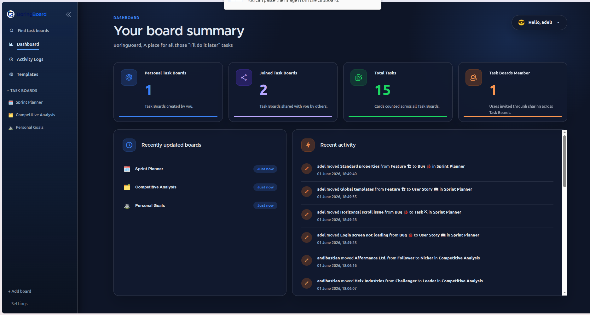
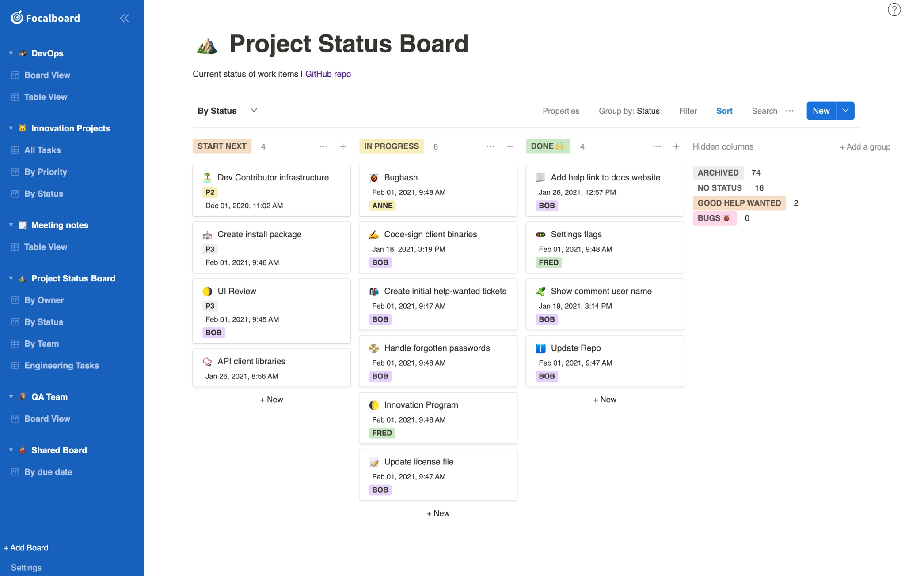

# BoringBoard

Focalboard is one of those rare tools that just makes sense. Simple, clean, and easy to understand. Big love to the original team ❤️

BoringBoard started as a small fork of Focalboard, then slowly evolved into my personal playground for project management. It follows my own workflow, habits, and occasionally my questionable decisions.

The goal isn't to reinvent project management. The goal is to make it a little less painful, a little more practical, and maybe even a little less boring.

That's why it's called **BoringBoard**.

**Default Theme**


**Dark Theme**


## Added Features

- **AI integration**: Create task board previews from a command before creating the real board.
- **Available AI providers**: OpenAI, Gemini, Ollama, Cline, and Anything LLM.
- **AI model selection**: Select provider models from System Settings, including Ollama model loading from the configured endpoint.
- **Centralized admin user**: Default `SuperAdmin` user/group support with configurable admin username and password from `.env`.
- **User management**: Admin-only Users menu with search, group filtering, pagination, add/edit/delete modals, and Tabler-styled tables.
- **Activity logs**: Admin activity log view across registered users with search, filters, date range, pagination, and scrollable table area.
- **System Settings**: Manage app name, logo upload, timezone, AI provider settings, and task board permissions.
- **Realtime settings updates**: Branding, logo, and selected task board permission settings update across active clients.
- **Task board permissions**: Configure whether invited users can share task boards or edit task board properties.
- **Task board settings**: Board owners can save repository, dev/prod branch, and environment URL details at the task-board level, with a read-only Task Board Info panel in the board header.
- **Profile menu improvements**: Top-right user menu with Invite users, Profile, Change password, and Logout modals.
- **Branding updates**: Custom app name/logo support with circular logo preview and sidebar display.
- **Table utilities**: Reusable table module with search alignment, Options menu, and print/export actions.

## How to start

Create an `.env` file in the BoringBoard directory if it does not already exist:

```bash
EXCLUDE_ENTERPRISE="1"
EXTERNAL_PORT="8000"
BORINGBOARD_DEFAULTADMINUSERNAME="admin"
BORINGBOARD_DEFAULTADMINPASSWORD="admin123"
BORINGBOARD_AI_OPENAI_ENDPOINT="https://api.openai.com/v1"
BORINGBOARD_AI_GEMINI_ENDPOINT="https://generativelanguage.googleapis.com/v1beta"
BORINGBOARD_AI_OLLAMA_ENDPOINT="http://localhost:11434"
BORINGBOARD_AI_CLINE_ENDPOINT="https://api.cline.bot/api/v1"
BORINGBOARD_AI_ANYTHINGLLM_ENDPOINT="http://localhost:3001/api/v1"
BORINGBOARD_AI_TIMEOUT="180"
```

Run the local development script:

```bash
./run.sh
```

Then open:

```text
http://localhost:8000
```

The script starts the server, builds/watches the web app, clears ports `8000` and `8001` when needed, and enables browser auto-reload for frontend changes.

---

<details>
<summary><strong>Original Focalboard README</strong></summary>

The content below is kept from the original Focalboard project for upstream reference.




BoringBoard is an open source, multilingual, self-hosted project management tool that's an alternative to Trello, Notion, and Asana.

It helps define, organize, track and manage work across individuals and teams. Focalboard comes in two editions:

- **[Personal Desktop](https://www.focalboard.com/docs/personal-edition/desktop/)**: A standalone, single-user [macOS](https://apps.apple.com/app/apple-store/id1556908618?pt=2114704&ct=website&mt=8), [Windows](https://www.microsoft.com/store/apps/9NLN2T0SX9VF?cid=website), or [Linux](https://www.focalboard.com/download/personal-edition/desktop/#linux-desktop) desktop app for your own todos and personal projects.

- **[Personal Server](https://www.focalboard.com/download/personal-edition/ubuntu/)**: A standalone, multi-user server for development and personal use.

## Try Focalboard

### Personal Desktop (Windows, Mac or Linux Desktop)

- **Windows**: Download from the [Windows App Store](https://www.microsoft.com/store/productId/9NLN2T0SX9VF) or download `focalboard-win.zip` from the [latest release](https://github.com/mattermost/focalboard/releases), unpack, and run `Focalboard.exe`.
- **Mac**: Download from the [Mac App Store](https://apps.apple.com/us/app/focalboard-insiders/id1556908618?mt=12).
- **Linux Desktop**: Download `focalboard-linux.tar.gz` from the [latest release](https://github.com/mattermost/focalboard/releases), unpack, and open `focalboard-app`.

### Personal Server

**Ubuntu**: You can download and run the compiled Focalboard **Personal Server** on Ubuntu by following [our latest install guide](https://www.focalboard.com/download/personal-edition/ubuntu/).

### API Docs

Boards API docs can be found over at <https://htmlpreview.github.io/?https://github.com/mattermost/focalboard/blob/main/server/swagger/docs/html/index.html>

### Getting started

Our [developer guide](https://developers.mattermost.com/contribute/focalboard/personal-server-setup-guide) has detailed instructions on how to set up your development environment for the **Personal Server**. You can also join the [~Focalboard community channel](https://community.mattermost.com/core/channels/focalboard) to connect with other developers.

Create an `.env` file in the focalboard directory that contains:

```
EXCLUDE_ENTERPRISE="1"
```

To build the server:

```
make prebuild
make
```

To run the server:

```
 ./bin/focalboard-server
```

Then navigate your browser to [`http://localhost:8000`](http://localhost:8000) to access your Focalboard server. The port is configured in `config.json`.

Once the server is running, you can rebuild just the web app via `make webapp` in a separate terminal window. Reload your browser to see the changes.

### Building and running production builds

- **Linux server package**:
  - Run `make prebuild`
  - Run `make server-linux-package`
  - Uncompress `dist/focalboard-server-linux-amd64.tar.gz` to a directory of your choice.
- **Docker**:
  - To run it locally from offical image:
    - `docker run -it -p 80:8000 mattermost/focalboard`
  - To build it for your current architecture:
    - `docker build -f docker/Dockerfile .`
  - To build it for a custom architecture (experimental):
    - `docker build -f docker/Dockerfile --platform linux/arm64 .`

### Unit testing

Before checking in commits, run `make ci`, which includes:

- **Server unit tests**: `make server-test`
- **Web app ESLint**: `cd webapp; npm run check`
- **Web app unit tests**: `cd webapp; npm run test`
- **Web app UI tests**: `cd webapp; npm run cypress:ci`

### Staying informed

- **Changes**: See the [CHANGELOG](CHANGELOG.md) for the latest updates
- **Bug Reports**: [File a bug report](https://github.com/mattermost/focalboard/issues/new?assignees=&labels=bug&template=bug_report.md&title=)
- **Chat**: Join the [~Focalboard community channel](https://community.mattermost.com/core/channels/focalboard)

</details>
